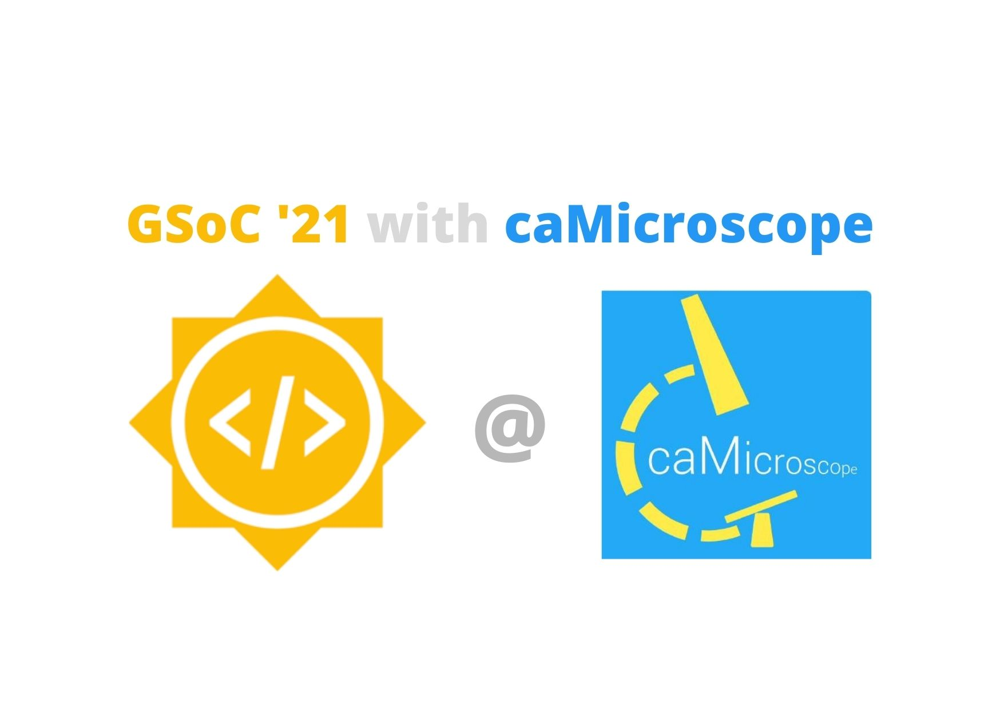

# Google Summer of Code Logs

I, [Yash Kumar Verma](https://www.linkedin.com/in/yash-kumar-verma/) am a third year undergraduate student from India. During the summer of 2021, I worked as a student software developer in Google Summer of Code with [caMicroScope](https://github.com/camicroscope). I am a full stack developer, and used my skills to complete the following objectives.

## Objectives

- [x] Role Based Access Control System
  - [x] To remove the old attribute based control system.
  - [x] To implement a role based access control system.
  - [x] To come up with a new structure for the routes file and migrate old routes to new formats.
  - [x] To cover all routes defined in the application under a control system without explicit declarations.
  - [x] To provision dynamic roles in the system which can be configured / defined as per needs.
  - [x] To load the definitons about the roles in the system via database in place of static files.
  - [x] To create a responsive and dynamic admin panel in React to configure the rules in realtime.
  - [x] To declare APIs that allow the admin to configure the portal in realtime.
- [x] Caching database calls
  - [x] To research on a method that works consistently with all functions with minimum changegs.
  - [x] To write a robust library (discussed later) to dynamically cache any given function.
  - [x] To future proof the library by extending support for typescript if migration / upgrate happens.
  - [x] Robust testing of the caching library to ensure consistent results.
- [x] Objectives completed which were originally not part of the proposal
  - [x] Break the codebase into modules / services that deal with specific functionality.
  - [x] Stream lined use of environment variables in the application.
  - [x] Single point configuration for databases and roles services.
  - [x] Refactor a major part of main application.
  - [x] Wrote documentation for parts of project that were not under scope of the proposal.
  - [x] Established a new code style based on airbnb's guiide.
  - [x] Fixed almost all critical linting issues.
  - [x] Published a standalone library on NPM for caching that can be used in other projects as well.
